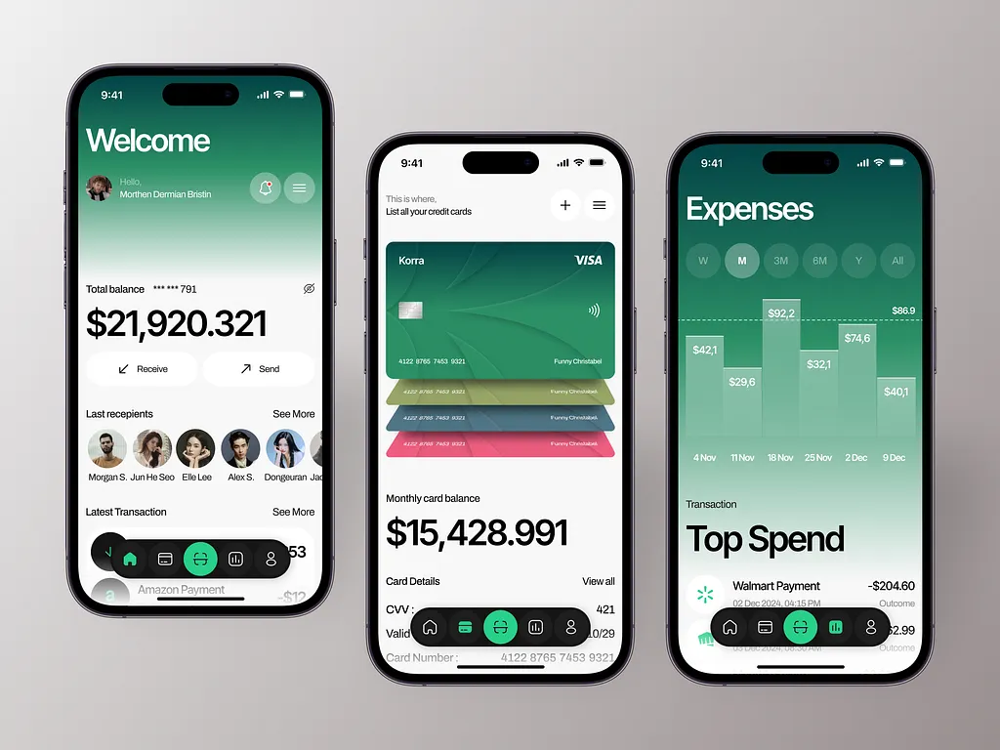

# epay

ePay's transaction dashboard showcases a sleek Flutter UI with animated transaction cards, balances, and fluid swipe gestures, all wrapped in delightful micro-interactions.

 The design combines smooth  animations with practical filtering tools, making financial tracking visually engaging and effortless.

# For Help
For help getting started with Flutter development, view the
[online documentation](https://docs.flutter.dev/), which offers tutorials,
samples, guidance on mobile development, and a full API reference.
